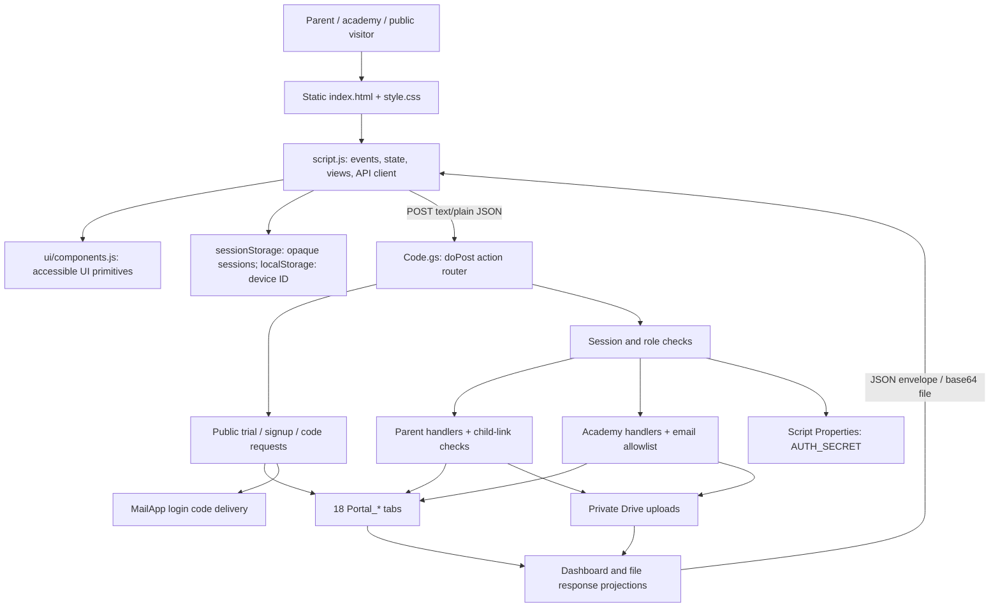

# Eduwave architecture review and refactor

Reviewed 2026-09-08 on `codex/unified-portal-revamp`, base revision `f7df4a3646b290eb9e150bc41cc55b9f00b76f1b`.

Evidence publication boundary: this report and `PROJECT_MEMORY.md` are committed separately from the mixed local implementation work. The source changes and regression tests described here are not included in this evidence-only commit. The push-time scoped test rerun passed 10/10; the then-current local `npm test` also included the new dashboard regression test through separate tooling work.

## Assessment

This is a small deployment with substantial domain logic, not a distributed application: a static browser client calls a single Google Apps Script API backed by 18 Google Sheet tabs, private Drive uploads, and email. The simplicity fits the documented trial constraints. The main risks are repeated remote reads, non-atomic multi-record operations, and growing full-history responses—not the absence of a frontend framework.

This review follows the application source and tests observed during this task. It does not establish the state, traffic, data volume, or reliability of the deployed academy workbook. Existing and concurrently arriving frontend/UI work was preserved. This change edits the backend and adds independent regression tests and documentation.

At final verification, separate work was also adding `package.json`, `ops/`, Docker/Compose, Kubernetes manifests and a production workflow. The inspected Dockerfile serves prebuilt `dist/` through Nginx; these additions do not replace the Apps Script data backend. They were still changing and are not certified by this review. Findings about missing build/test tooling describe the starting snapshot; reconcile them with that parallel deployment work before implementing them again. In particular, its observed `npm test` command did not yet include `tests/dashboard-refactor.test.js`.

A later concurrent extraction also made `Code.gs` a generated artifact. The refactors are retained in `apps-script/src/application/dashboard.gs`, `apps-script/src/projections/dashboard.gs`, and `apps-script/src/adapters/sheets.gs`, with ordering in `apps-script/modules.json`. Edit those source modules going forward. The explicit ten-check regression command was rerun against the newly generated backend and still passed. Recommendations about splitting the original monolith describe the initial architecture; the concurrent extraction is already addressing them.

## Architecture and trust boundaries



| Component | Responsibilities | Coupling / operational boundary |
| --- | --- | --- |
| `index.html`, `style.css`, `images/` | Marketing, trial form, dialogs, templates, responsive layout | Static assets; Google Fonts is an external dependency. Root videos/audio are not loaded by the current page. |
| `script.js` | API transport, authentication steps, browser state, parent/admin rendering, file encoding, mutation handlers | One IIFE; HTML generation and orchestration share mutable state. Deployment URL is inline. |
| `ui/components.js`, `ui/components.css` | Busy buttons, status, notifications, keyboard tabs, validation enhancement | Existing separate presentation layer, still evolving during this review. |
| `apps-script/Code.gs` | Router, auth policy, business rules, persistence, file handling, projections, migrations | One deployable Apps Script file; public handlers authorize on the server. |
| `appsscript.json` | V8 runtime, timezone, Sheets/Drive/mail permissions | API executes as deploying account and accepts anonymous HTTP requests; identity enforcement is application code. |
| Google Sheets | Identities, links, sessions, learning/finance records, config, audit | No application-enforced foreign-key constraints or transactional database boundary. |
| Private Google Drive | Uploaded material and submissions | Parents receive authenticated content, not permanent Drive sharing links. |
| Tests | Apps Script service mocks, source structure checks, dashboard behavior oracle, UI browser checks | Mock tests do not reproduce Google service latency, failures, concurrent executions, or quotas. |

## Complete application data flow

### 1. Startup, public site, and API transport

`DOMContentLoaded -> init()` binds navigation, dialogs, forms, tabs, image fallbacks and reveal effects. `restoreSessions()` independently attempts the stored parent and academy sessions, sequentially. The device ID is stored in localStorage; raw session tokens are stored in sessionStorage and included in protected POST bodies.

`api(action, payload)` sends a JSON body with a `text/plain` content type to the configured `/exec` URL. `doPost` parses it, switches on one of 28 actions, and returns `{ok, message, data}`. Exceptions become an unsuccessful JSON envelope. The browser throws when `ok` is false. There is also a public `doGet` health response. There is no explicit frontend request deadline, retry/idempotency protocol, or cancellation handling.

### 2. Signup, approval, login, and logout

`signupParent` validates name/email/mobile and creates or updates a pending parent under a script lock. It does not grant a session. Academy approval changes the parent status and updates links. `requestLoginCode` checks the admin allowlist or active parent/mobile match; legacy blank parent mobiles can be captured at this step. Ineligible accounts receive the same nominal response without email.

Eligible requests scan code history for rate limits, retire earlier unused codes, store an HMAC plus device hash and expiry, and send MailApp email. The email call is inside the global script lock. `verifyLoginCode` finds the matching unused code/device, checks expiry/attempts/HMAC and consumes the code under a lock. It then releases that lock, creates a session, revokes older sessions, logs the login, and assembles the role-specific dashboard.

Session checks hash the presented token, validate role/revocation/expiry/idle timeout, and update `last_seen_at`. Parent handlers additionally require an active parent; academy handlers recheck configured allowlisted email. Logout revokes the record; the browser removes its local token. The device hash is used in OTP verification; ordinary session requests act as bearer-token authentication.

### 3. Parent dashboard, learning, and files

`parentDashboard -> parentFromSession_ -> dashboardForParent_` selects active links and active students. Each child receives published assignment summaries, the first matching submission, and up to six fee, attendance and progress records. Notifications select visible assignments, unpaid fees and currently applicable announcements, then return the first 20 in existing category/order precedence.

The refactor reads the nine dashboard source tables once per dashboard assembly, builds local indexes, and shares that data between child and notification projections. It has no cache across HTTP requests and is not a transactional database snapshot. Config and authentication reads are separate.

`parentResource` rechecks the session and child link, requires a published assignment and resource, and logs the open. Worksheets are returned as table rows. Files require a portal-upload index record marked safe; the backend reads Drive bytes and returns base64 data for PDF/image previews or Office/text downloads. The frontend overlays a watermark and emits an additional `parentEvent` audit request.

`parentSubmitAssignment` rechecks ownership, assignment/resource status and submission type; reviewed submissions are locked. Answers and notes are bounded and normalized. Optional files are decoded and saved privately, then a submission is inserted/updated. An old attachment is trashed after replacement metadata is saved. The frontend refreshes the parent dashboard after success.

### 4. Finance, family lifecycle, and academy workflows

Parent payment notes require a linked child and matching fee record. They set `pending_verification`; academy verification sets `paid`. No payment gateway confirms funds. Monthly generation checks active students with positive fees and inserts missing student/month rows. Reminders store a WhatsApp click-to-chat URL; a human sends the message.

The academy creates parents, students and links; records attendance/progress/notices; uploads resources; assigns or revokes materials; reviews submitted work; and updates trial requests. Mutations generally trigger a complete `adminDashboard` reload in the frontend.

Leaving parent: update status, deactivate links, revoke sessions. Restoring parent: reactivate links only to active children. Leaving student: update enrolment, deactivate links and revoke published assignments. Restoring student: reactivate links only to active parents; revoked assignments stay revoked. Historical records remain available.

`adminData_` reads entire operational tables, constructs the family directory and metrics, and returns all fees, resources, assignments, submissions and trials. Submissions are filtered/paged ten at a time only after this full response reaches the browser. Reminders/activity are sliced to 50 after the backend reads and sorts their full sheets.

### 5. Setup and migration

`setupEduwave` ensures required headers, creates the auth secret and default configuration, and appends an audit record. Upload folders are lazily created and their IDs stored in config. `upgradeFileUploads` upgrades a narrower schema. `retireLegacyDriveArchive` is an explicit destructive migration for obsolete catalogue records; normal requests do not scan arbitrary Drive folders. Manual source copying and versioned Apps Script deployment are documented in `SETUP_STEPS.md`.

## Data model

| Tabs | Relationship / use |
| --- | --- |
| `Parents`, `Students`, `ParentStudents` | Parent/student many-to-many relationship; link-active, parent status and student enrolment are separate concepts. |
| `Sessions`, `LoginCodes` | HMAC-based identity proofs and session history; role/email/device, expiry, attempt and revocation fields. |
| `Resources`, `DriveIndex`, `WorksheetRows` | Reusable materials backed by a deliberate Drive upload or inline worksheet questions. |
| `Assignments`, `Submissions` | Student/resource relationship and submitted answers/file metadata. Intended first-match relationships are not enforced as unique constraints. |
| `Fees`, `Attendance`, `Progress`, `Announcements` | Student financial and learning state; notices may target everyone or one student. |
| `Trials`, `Reminders`, `AuditLogs`, `Config` | Public intake, manually sent reminders, audit history, deployment settings. |

All names above have the `Portal_` prefix. IDs are application-generated strings. Reads use `getDisplayValues()`, so numeric/date interpretation depends on serialization, formatting and normalization conventions. `_row` is a physical Sheet row locator, not a stable business identifier.

## Critical problems and refactoring strategy

Severity is based on source-level impact. Concurrency and service-failure scenarios below are inferred risks, not reproduced production incidents.

| Priority / category | Evidence and consequence | Strategy / status |
| --- | --- | --- |
| P1 — write correctness | Original `append_`, `update_`, `replaceData_` used `HEADERS` order while `rows_` read actual headers. Reordered/upgraded workbooks could put values under the wrong fields. Full-row display-value writes could flatten untouched formulas. | **Implemented:** map writes by actual header row, validate required fields, write only supplied update fields in contiguous ranges, preserve untouched cells. Replacement migration still intentionally rewrites records; it is not a formula-preserving migration. |
| P1 — concurrent sessions | `verifyLoginCode_` releases its lock before `createSession_`; two executions can each observe no active session and insert one, violating the intended single-session invariant. | Enclose revocation and insertion in one short critical section, test explicit interleavings, flush before release. Avoid nesting existing script locks. Not changed in this refactor. |
| P1 — duplicate/lost mutations | `generateMonthlyFees_`, family creation, attendance upsert and resource assignment use unlocked check-then-write. Multi-row status changes are not atomic. Two fee runs can both see a missing record. | Centralize locking around each complete read/validate/write invariant, use stable idempotency keys and uniqueness checks, and make failure recovery explicit. Do not add automatic browser retries before this exists. |
| P1 — repeated remote reads | Original `childViews_` read assignments/history per child, resources per assignment; `notifications_` repeated resource/submission reads. | **Implemented:** operation-local data loader and indexes. Fixture with 100 students: 1,492 dashboard table reads reduced to 9; exact response equality verified. Data volume is still linear in total table size. |
| P1 — storage consistency | `adminUploadResource_` creates a Drive file before resource/index/audit writes. Submission uploads can precede later validation/write failures. No transaction covers Drive plus Sheets. | Validate all request semantics before upload; introduce staged uploads and compensating cleanup/reconciliation. Retain the old file until the metadata commit succeeds. Test failures at each boundary. |
| P2 — visibility policy drift | Notification filtering checks `visible_from`; child assignment summaries and `parentResource_` do not. Resource publication checks also differ between summaries and opening. | Agree on one visibility predicate, then use it across listing/open/submission. Existing differing behavior was deliberately preserved because changing release timing changes functionality. |
| P2 — unbounded payloads | `adminData_` returns complete histories; frontend `submissionsPanel` pagination saves rendering work but not backend I/O, response size or browser memory. Audit/session/code tables grow without retention. | Add versioned cursor endpoints and server-side filters, reduce dashboard to summaries, define retention/archive policy, and migrate the existing UI incrementally. |
| P2 — global lock throughput | `requestLoginCode_` calls external email service while holding the global script lock; unrelated eligible logins queue behind it. | Persist code/delivery state under a short lock, send outside, reconcile failures safely. Retain code-consumption and rate-limit guarantees. |
| P2 — nested in-memory joins | `adminFamilyDirectory_` originally rescanned links per parent and students per link. Browser material/assignment renderers similarly perform nested searches. | **Implemented backend directory indexes**, preserving duplicate first-match behavior and ordering. Next: derive frontend indexes once when a new dashboard arrives. |
| P2 — duplicated orchestration | Frontend trial/signup/code/upload/admin handlers repeat validation, busy-state, status, try/catch/finally and refresh. MIME/size policy and status normalization appear in both runtimes. | Extract a small form-action lifecycle helper with explicit success callbacks. Keep server validation authoritative; share a generated public policy contract where useful. Keep HTML escaping distinct from backend input trimming despite both being named `clean`. |
| P2 — async UI races | `refreshParent`, `refreshAdmin`, `resource` and `submissionFile` commit responses without checking whether logout, child selection or a later request superseded them. | Add session/request-generation checks and cancellation for reads; characterize logout-during-request and reversed response order first. |
| P2 — monolithic maintainability | Many backend handlers and frontend templates are single long lines. Routing, business policy, persistence and presentation share files. | Extract by domain behind existing function names. Keep one deployable `Code.gs` via a deterministic build if split source is introduced. Avoid changing all formatting alongside logic. |
| P2 — insufficient failure coverage | Existing mock auth tests serialize calls; structure tests often match source strings. The starting snapshot lacked a package manifest; browser tests need an explicit runtime/server setup. | Add API contract tests, concurrent interleaving and service-failure mocks, a reproducible test entry point, and deployment smoke checks on a separate workbook. This change adds eight focused regression tests. Coordinate test-entry changes with the concurrent tooling work. |

The current deployment also accepts public trial submissions without an application-level throttle, and generic Sheet writes do not establish an explicit untrusted-text/formula policy. Review both before exposing this as a high-volume public service. These are additional hardening tasks, not changes made here.

## Scaling and production boundary

The nine-table loader removes repeated reads but still reads the entire tables into one execution's memory. It is an intermediate improvement, not a database index. It does not provide isolation from other executions. Header-aware writes add a header read, and non-adjacent updates can require multiple write calls; the benefit is correctness and preservation of unrelated cells, not a blanket write-speed claim.

Google recommends minimizing service calls and using batch operations; the local-index approach follows that guidance. Apps Script also imposes execution, concurrency and service quotas; failures stop execution. Track actual request latency, response bytes, table sizes, quota usage and failure rates before choosing a capacity threshold. No numeric production capacity is claimed here. Sources: [Google Apps Script best practices](https://developers.google.com/apps-script/guides/support/best-practices), [Google service quotas](https://developers.google.com/apps-script/guides/services/quotas).

Base64 file responses expand bytes by roughly one third before JSON/browser copies. The configured 8 MiB upload becomes about 10.7 MiB of encoded data. For larger usage, move delivery to a storage service with short-lived authorized downloads, with an explicit access policy; do not replace private delivery with permanent public Drive links.

A staged path preserves the product:

1. Keep the current API and deployment shape; land the tested read/write refactors here.
2. Add concurrency control, idempotency, upload recovery and failure tests as isolated changes.
3. Introduce bounded read endpoints and adapt each existing screen without changing its visible behavior.
4. Add explicit response schemas, environment configuration, structured request IDs/metrics, repeatable build/test/deploy steps and a staging workbook.
5. When measured usage exceeds the spreadsheet deployment's practical limits, put the same repository interface over a transactional database with unique keys, foreign keys and indexed queries. Migrate/reconcile data and preserve endpoint contracts before switching traffic.

Splitting into microservices or rewriting the website in a framework would not by itself address these risks.

## Implemented code and compatibility

`apps-script/Code.gs` now separates dashboard loading (`dashboardData_`), indexing (`firstIndex_`, `groupIndex_`), and projection (`childViews_`, `notifications_`). `adminFamilyDirectory_` reuses the same index helpers. Storage serialization is centralized in `sheetHeaders_` and `recordValues_`.

The 28 API action names, envelope shape, sheet schema, authentication rules, file limits, assignment visibility behavior, notification precedence, sort order and six/twenty-item caps are retained. The deployable backend remains a single file; concurrent source extraction now generates it from modules as noted above. Existing frontend source files were not edited by this task.

The test-only `tests/fixtures/legacy-dashboard.js` freezes four pre-refactor functions as a behavior oracle. It is intentionally duplicate legacy code outside production; it should not be deployed or edited to match a failing implementation. Once equivalent explicit contract fixtures fully replace it, it can be removed.

## Verification and deployment

Baseline: original auth and structure suites passed before edits. A first sandboxed Node test attempt failed because subprocess creation was denied (`EPERM`); the authorized run outside the sandbox passed.

Added regression checks cover exact dashboard payload/order equality for 0, 1, 3, 20 and 100 students; duplicate IDs/submissions; missing resources; future visibility; active/former/unlinked filtering; first-match semantics; notification limits; snapshot non-mutation; fresh revocation visibility; reordered/custom headers; untouched formulas; adjacent update batching; and missing-schema failure before a write.

The first expanded wildcard run passed ten checks but failed the independently added browser test because `playwright` was not on Node's module path. With the bundled runtime and headless Edge, that test proceeded but failed the site overflow assertion: document width 504 at viewport width 320. This is a frontend layout finding outside the backend changes; the full browser suite is not green. The exact backend/structure command below passed all ten checks, and JavaScript syntax and `git diff --check` passed. Final test evidence is recorded in `PROJECT_MEMORY.md`.

```powershell
node --test tests/auth-flow.test.js tests/site-structure.test.js tests/dashboard-refactor.test.js
```

No live OTPs, payments, writes, uploads, migrations or deployment were performed. Local mocks establish regression behavior; they do not certify production reliability. Before deployment, run against a private staging workbook with both canonical and rearranged headers, exercise actual Sheets/Drive/mail, then use the existing versioned Apps Script deployment procedure. This refactor needs no schema migration. Keep the previous backend version available for rollback.
