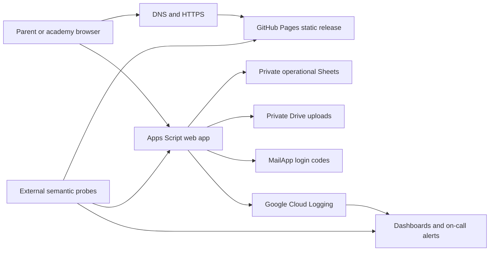

# Eduwave production deployment

Prepared 2026-09-08. **This is a release preparation, not an operational production certification.** No cloud, cluster, domain, monitoring account, backup destination or staging backend was supplied. No infrastructure was provisioned and no deployment was performed. Existing uncommitted application/UI refactors are preserved. Treat the entire reviewed release, including those files, as the deployment unit.

## 1. Infrastructure architecture

The current application is static HTML/CSS/JavaScript with passwordless parent/admin access to an Apps Script web app executing as its owner. Sheets is the record store, Drive holds private uploads, and MailApp sends login codes. Manual UPI references are recorded; this is not a payment processor. The current account is a consumer Gmail account. Containerizing the frontend does not containerize Apps Script or increase its quotas.

Recommended initial delivery: retain GitHub Pages while validating a tightly bounded academy workload. Avoid paying for Kubernetes solely to serve static files. The repository also provides a portable Kubernetes option for an organization that already operates a cluster or needs configurable HTTP headers. Production launch remains blocked on backend capacity, recovery, abuse protection and concurrency gates below.



GitHub Pages protects only frontend delivery. A frontend CDN, WAF or ingress does not protect the directly callable Apps Script URL. Sensitive responses must never be cached at an added intermediary. Keep spreadsheet, upload folders, auth secret and operational backups private. The frontend API URL is public configuration, not a credential.

For Kubernetes: DNS → managed HTTPS load balancer → supported ingress controller → ClusterIP Service → Nginx pods across three zones. Use a managed control plane, at least one schedulable node in each of three zones, a network-policy-capable CNI, Metrics Server and node autoscaling. Nodes need enough free capacity for one surge pod and zone failure. Install ingress, certificate automation and monitoring as separately owned platform services. Resource requests/HPA limits are starting values to benchmark, not proven capacity.

### Revenue-critical backend destination

Before unbounded growth, replace Apps Script with a managed API using managed PostgreSQL with point-in-time recovery, private object storage, a durable work queue and a transactional email provider. Use per-family authorization, unique constraints, atomic transactions, request idempotency keys, worker retries/dead letters, and a transactional outbox for email/file jobs. Prefer managed containers with a minimum warm instance count and database connection pooling; adopt Kubernetes for this API only if operational ownership justifies it.

Migration: define contract tests → private staging data import → validate record counts, relationships and sampled file hashes → shadow reads with no side effects → brief controlled write freeze and final delta reconciliation → switch API URL → observe. Keep the old backend read-only for a defined reconciliation period. Do not dual-write fee records without an explicit conflict strategy. A frontend rollback after new-backend writes requires a data reconciliation decision, not simply reverting the URL.

## 2. Deployment workflow

1. Review a PR including generated bundles, source modules and regression evidence. `npm ci`, `node tools/build.cjs --check`, `npm test`, browser tests and the container gate must pass. Configure the CI check as required on the actual release branch; do not assume this working branch is the production branch.
2. Use a separate Apps Script project, workbook, Drive folders and test inboxes for staging. Build with staging `API_URL`. Test real login, authorization boundaries, uploads/downloads, revocations and payment-note flows there. Local mocked tests cannot establish these behaviors in Google services.
3. Back up production data and record the last working Apps Script version, frontend commit, API URL and release artifact checksums in a private release record. Preserve the source backend artifact alongside the release.
4. Deploy a backward-compatible backend version first via Apps Script **Manage deployments → edit existing deployment → New version**. Keep the stable `/exec` URL. Generate `Code.gs` from source; only upload `Code.gs` and `appsscript.json`, not the individual source modules as well. Run only necessary additive schema updates. Test health plus an authorized synthetic parent/admin workflow.
5. Manually dispatch **Production readiness**, select the reviewed release ref, and set `deploy_pages=true`. The same job tests and packages the frontend. A protected `github-pages` environment approves promotion of that exact artifact. Concurrent production deployments are serialized and not canceled mid-release.
6. Check the deployed `release.json` revision and the backend JSON envelope. Watch errors, latency, login delivery and user reports for at least 30 minutes. A failed post-release check fails the job and requires an operator; it does not automatically roll back backend data.

### One-time GitHub configuration

- Set Pages source to **GitHub Actions**. Configure repository variable `API_URL` to the production `/exec` URL. Configure this before requesting a deployment.
- Protect the actual release branch: PR review, passing CI and blocked force pushes. Restrict the `github-pages` environment to that branch, require a release approver and disallow self-approval where available. These controls are GitHub settings and cannot be established by committing YAML alone.
- Enable workflow failure notifications for the release owner. Ensure production Pages is appropriate for the account's terms and service requirements. Confirm the generated Pages URL includes the repository path where relevant. Configure a custom domain and HTTPS in Pages if needed.
- Keep repository content read-only by default. Only deployment receives Pages write and OIDC token permissions. Actions are SHA-pinned; Dependabot proposes updates. Fork PRs receive no production credentials.
- CI rejects HIGH/CRITICAL container findings through a pinned Trivy action; npm audit separately checks Node dependencies. Neither scan has been executed in GitHub by this task. Record any accepted exceptions with an owner and expiry. Keep the Nginx digest patched through reviewed updates.

## 3. CI/CD pipeline

`.github/workflows/production.yml` runs on PRs and pushes; production promotion requires explicit dispatch. Stages: dependency installation/audit → application and production tests → mocked browser tests → allowlisted artifact → hardened container checks → Kubernetes render → retained artifact → protected Pages promotion → external smoke.

`ops/build.js` first compiles source modules, then copies only public assets. It validates the API URL, excludes backend/test/docs source, adds `healthz` and a revision/checksum manifest. Keep `dist` generated and untracked. GitHub keeps release artifacts for 30 days; copy accepted releases to the organization's durable release store if a longer rollback window is required.

The pipeline does not deploy Apps Script automatically: Google project identity and an approved deployment workflow are absent. Use the reviewed manual backend promotion above. Do not store personal OAuth refresh tokens or kubeconfig in source. Future cloud CI should use environment-scoped OIDC federation with restricted repository/ref/subject and least privilege.

## 4. Docker and Kubernetes setup

Local container validation (Docker required):

```sh
npm ci
npm run build
docker compose up --build -d
docker compose ps
# PowerShell: $env:SITE_URL='http://127.0.0.1:8080'; npm run smoke
SITE_URL=http://127.0.0.1:8080 npm run smoke
node tests/container.test.js
docker compose down
```

Nginx runs as UID 101 with a read-only root, all capabilities dropped and `/tmp` as its only writable mount. It listens on 8080 and emits minimal JSON access logs. It does not proxy backend calls. Liveness checks only local serving; a Google outage must not restart healthy frontend pods. Graceful shutdown allows endpoint draining before Nginx QUIT. Docker's health check reports unhealthy status; Compose does not automatically restart an otherwise running unhealthy process.

Kubernetes preparation, after cloud/platform provisioning:

1. Build, scan and push the tested image to an owned registry. Record its immutable digest; configure private-registry pull access when required.
2. Replace the image placeholder in `deploy/kubernetes/kustomization.yaml` with a digest (`newName` plus `digest: sha256:...`, remove `newTag`). Replace ingress class, hostname and TLS secret. Label the chosen ingress namespace `eduwave-ingress=true`; validate the actual controller traffic source against the network policy. There is intentionally no wildcard ingress allowance or outbound pod traffic.
3. Provision three zones, supported ingress, TLS certificates, HTTPS redirects and HSTS at the edge, CNI policy enforcement, Metrics Server, registry credentials and monitoring. No cloud-specific controllers or certificates are included here. Verify controller health-check traffic and kubelet probes under the chosen CNI before traffic cutover.
4. Validate against staging first, then the target API server:

```sh
kubectl kustomize deploy/kubernetes
kubectl apply --dry-run=server -k deploy/kubernetes
kubectl diff -k deploy/kubernetes
kubectl apply -k deploy/kubernetes
kubectl -n eduwave rollout status deployment/eduwave-web --timeout=300s
kubectl -n eduwave get pods -o wide
kubectl -n eduwave get hpa,pdb,ingress
```

Require at least three Ready replicas, distribution across zones, a valid external certificate and semantic smoke success before DNS traffic. HPA owns replica count; deployment manifests do not continually reset it. HPA is 3–12 pods at 65% CPU with slow scale-down. CPU scaling cannot overcome node capacity, bandwidth limits or backend quotas. Load-test static throughput and large-file behavior to adjust CPU, memory and node ceilings. PDB protects voluntary eviction; it does not protect against zone loss or govern rolling updates.

Rolling updates use zero unavailable replicas and one surge. This reduces availability risk but does not guarantee an atomic multi-file frontend release: HTML/JS/CSS filenames are not fingerprinted. Require adjacent-release compatibility and revalidate caches. For incompatible frontend releases, first implement versioned asset URLs with old releases retained on object storage/CDN and atomically switch HTML; do not claim rolling replicas alone solve this. GitHub Pages cache/header behavior is platform controlled; Nginx headers apply only to the container route.

## 5. Monitoring and logging strategy

Proposed initial objectives, to be approved and measured: frontend availability 99.9% over 30 days; portal successful eligible operations 99.5%; p95 dashboard response under 3 seconds; p95 OTP delivery under 60 seconds. Target frontend recovery within 15 minutes; operational-data RPO 24 hours and RTO 4 hours until a tighter backup process is implemented. These are targets, not achieved guarantees. A daily backup cannot meet a one-hour RPO.

- External probes: configure `ops/monitoring/blackbox.yml` and `prometheus.yml` with real URLs and service addresses. Check frontend every 30 seconds and API JSON every 60 seconds. GET health validates configuration, not mail or every worksheet/file permission. Apps Script failures can be HTTP 200; inspect `ok`, `configured` and `auth` as well. Avoid login requests in high-frequency probes because they consume quota and can revoke sessions.
- Alerts: `alerts.yml` covers site/API failures, blind monitoring, certificate expiry, low replicas and HPA saturation. The platform must supply Blackbox Exporter, Prometheus, Alertmanager and kube-state-metrics. Install rules, run `promtool check config` / `promtool check rules`, configure an actual on-call receiver and induce a staging failure to verify delivery and recovery. No receiver has been configured or messaged by this task. Use an independent heartbeat/dead-man receiver to detect loss of Prometheus itself.
- Backend: `doPost` emits only `event=portal_request`, `ok` and `duration_ms`, including caught failures; logging failures do not affect the response. Link Apps Script to an academy-owned standard Google Cloud project and export console logs to Cloud Logging. JSON is emitted as a string; verify `textPayload` versus structured ingestion before defining log-based counters and latency distributions. Alert on a sustained increase in failed requests; validation/auth rejections are included, so this is not a pure server-error rate.
- Dashboard panels: site/API success ratio, probe duration, request latency p50/p95/p99, API `ok=false` count, mail remaining quota, execution quota failures, active sessions, backup last success/age, replica readiness, HPA desired/current replicas and memory/restarts. Mail quota and backup-age signals require scheduled platform instrumentation; they are not emitted by the request logger. Inspect `MailApp.getRemainingDailyQuota()` in an authenticated operator workflow and implement its scheduled export before relying on quota alerts.
- Logging: ship Nginx stdout through the platform agent to centralized storage. Do not ingest bodies, OTPs, tokens, email/phone numbers, student names or submitted files into operational telemetry. Nginx error logs may include request context despite minimal access logging; apply collector redaction and never put secrets in URLs. Existing `Portal_AuditLogs` is a separate sensitive business audit store with restricted access. Retain operational logs for an initially proposed 30 days, review access and retention according to academy policy, and protect exports. The report-only CSP produces browser diagnostics but has no report collector; it is not an enforced script policy.
- Release evidence: record revision and UTC deployment time, annotate monitoring manually, and retain before/after dashboards. Add browser error reporting with consent/redaction and explicit ownership before treating real-user failures as monitored; no RUM service is configured here.

## Backup and recovery

Assign a data owner. Schedule encrypted daily backups of the complete workbook and uploaded Drive files to a separately controlled destination; include permissions, a file-ID-to-backup-object manifest, timestamps and checksums. A copied spreadsheet alone is insufficient because restored Drive files may have different IDs. Preserve IDs when possible or reconcile the manifest into resource/submission records in an isolated recovery environment. Back up protected configuration separately; never publish `AUTH_SECRET` or Sheets exports as CI artifacts.

Keep 30 daily backups plus pre-release snapshots as an initial retention proposal. Alert when the last successful backup exceeds 26 hours. Apps Script execution limits may require a paginated external backup worker. This worker/storage/alert is not provisioned. Prove restore before launch: isolate a workbook and files, restore config, rebind the script, rotate auth secret/invalidate sessions, reconcile links/fees/files, test cross-family denial and downloads, and measure elapsed recovery time. Repeat monthly. Never restore a whole old workbook over newer payment records without reconciliation and business-owner approval.

## Incident response

1. Acknowledge within five minutes; identify whether frontend, API, mail quota or data access failed. Freeze releases. Check last deployment, probes, quota, execution logs, DNS/certificates and backup status. Do not retry financial/file writes blindly after a lost response.
2. For frontend regressions, redeploy a known-good retained Pages artifact using its trusted workflow run where available, or dispatch the workflow on the reviewed known-good revision if that revision contains the release tooling. Verify `release.json` and public assets. Do not roll back the backend solely because a frontend check failed.
3. Kubernetes: `kubectl -n eduwave rollout undo deployment/eduwave-web` followed by rollout status and external smoke. Revert the declarative image digest as well so the next apply does not reintroduce the bad version. Schema/data changes are not reversed by this command.
4. Backend regression: select the recorded previous version in Apps Script Manage deployments while retaining its deployment URL. Only do this when the previous version remains compatible with current schema/data. For corrupt data or incompatible migrations, halt affected writes and reconcile before reopening.
5. For quota exhaustion, preserve active sessions and avoid repeated OTP attempts. Publish a service notice through the academy's approved channel. Scaling Nginx cannot fix this. Record the user-visible impact, remedy, data reconciliation and follow-up owner.

## 6. Production deployment checklist

- [ ] Name the service owner, backup owner, release approver and on-call contact; agree objectives and traffic forecast.
- [ ] Review all concurrent source/UI changes; compile and commit source plus generated artifacts and lockfile together.
- [ ] Required PR checks pass, including browser, backend authorization, architecture, production tests and container runtime checks.
- [ ] Production environment/branch restrictions and explicit `API_URL` are configured; old deployment/version and rollback artifact are recorded.
- [ ] Separate staging workbook, Apps Script deployment, upload folders and inboxes are operational; no test writes to production.
- [ ] Real parent/admin OTP, unauthorized family denial, session revocation, fees, uploads, downloads and status changes pass staging acceptance.
- [ ] Account ownership/recovery and two-step verification are established; Sheet/Drive/config and backups remain private.
- [ ] Load test representative history/data at expected peak plus agreed headroom; record backend quota, latency and failure results. Avoid stress testing production.
- [ ] Resolve or explicitly accept backend concurrency/idempotency risks for fees, session creation and multi-service file writes. UI duplicate-submit prevention is insufficient.
- [ ] Establish abuse controls for public trial/signup/login endpoints; the frontend edge cannot enforce limits on the direct Apps Script URL.
- [ ] Verify email daily headroom. Current Google published consumer quota is 100 recipients/day, Workspace 1,500; execution limits include 6 minutes and 30 simultaneous executions/user. Recheck actual account quotas at launch.
- [ ] Restore rehearsal meets approved RPO/RTO; backups and backup-failure alerts operate independently of the primary account.
- [ ] Probe and backend logging ingestion verified; on-call test alert delivered; quota/backup signals and monitoring heartbeat connected.
- [ ] HTTPS/domain and cache behavior verified; security headers reviewed for chosen host; CSP enforcement is separately tested before enabling.
- [ ] For Kubernetes: replace every placeholder, scan image, verify node/zone capacity, network policy, certificate renewal, graceful drain, HPA behavior and rollback under staged load.
- [ ] Approve the release, promote backend then frontend, verify actual revision, and complete a 30-minute observation period.

## References

- [Google Apps Script quotas](https://developers.google.com/apps-script/guides/services/quotas): account/service ceilings and quota exceptions.
- [Apps Script logging](https://developers.google.com/apps-script/guides/logging): standard Cloud project and Cloud Logging integration.
- [GitHub deployment environments](https://docs.github.com/en/actions/reference/workflows-and-actions/deployments-and-environments): approval and branch restrictions.
- [GitHub secure use](https://docs.github.com/en/actions/reference/security/secure-use): immutable action pins and permissions.
- [Kubernetes disruptions](https://kubernetes.io/docs/concepts/workloads/pods/disruptions/) and [autoscaling](https://kubernetes.io/docs/concepts/workloads/autoscaling/horizontal-pod-autoscale/): availability and HPA limits.
- [Nginx process control](https://nginx.org/en/docs/control.html): graceful QUIT handling.
